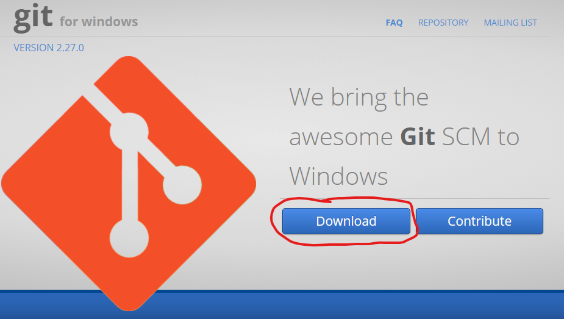
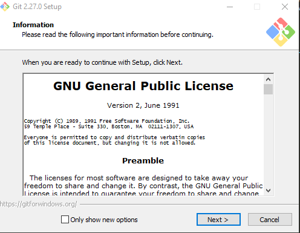
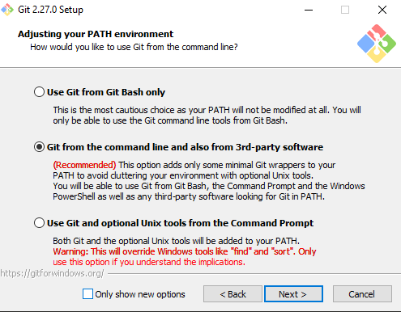
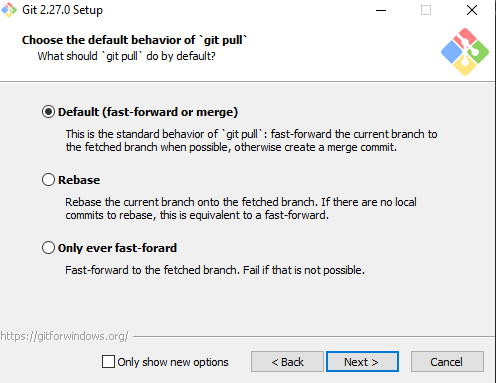
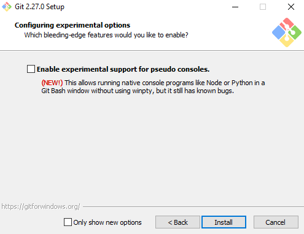

# [Computational Social Science] 
## 1-2 Command Line Intro

# Best Practices for Naming and File Location

Before we start, let's cover two important "best practices" that can greatly simplify your work: **naming conventions** and **folder location**.  While not mandatory, following these practices will improve your overall efficiency. The first practice pertains to naming conventions. When working in the command line, dealing with spaces in file and folder names can be problematic. Your computer might misinterpret commands when there are spaces in file or folder names. For instance, using the `mkdir` command to create a new folder named "Computational Social Science" would actually create three separate folders: "Computational," "Social," and "Science." To create a single folder, you'd need to enclose the name in quotes (e.g., `mkdir "Computational Social Science"`). This approach can be unwieldy, so it's advisable to use single-word names. There are three common formats for clear naming:

- The first is "snake case," which employs underscores to separate words (e.g., "this_is_my_file_name"). 

- The second is "camel case," where the first letter of each word is capitalized (e.g., "ThisIsMyFileName"). 

- The third is "spinal case," using hyphens to separate words (e.g., "this-is-my-file-name"). 

While seemingly minor, following this convention makes it easier to work in the command line and and enhances the readability of your `python` and `R` code. For a more in-depth discussion of the benefits and drawbacks of each convention, checkout this [YoutTube video](https://www.youtube.com/watch?v=u9ue_Oj-rVg&t=22s). Generally, it's best to adhere to the default naming convention established by the community for the language you're using. 

The second "best practice" to keep in mind is **folder location.** You will be navigating to folders in this class quite often, so you want to put them in a location that is easy to access but also is organized and intuitive. That said, there are different considerations. Many people keep much of my academic work on iCloud and track them with Git within each folder. However, it is not not super easy to navigate to these files via the terminal, but you can open a terminal directly from the finder. Google Drive and DropBox can be a bit easier to work with. One option is to keep projects that are not on iCloud but are being tracking with Git in a "Git" specific subfolder in the "home" directory so it is easy to access direclty from the terminal. For these projects, Git basically functions as a cloud storage because you can push and pull files across devices as long as you have an internet connection. 

# Working with the Command Line

You are probably used to interacting with your computer with **Graphical User Interfaces (GUIs)**. GUIs can make understanding and using software easy and intuitive, but come with some limitations too. Another way to interact with your computer is through the **Command Line Interface (CLI)**. CLIs allow you to interact with your computer directly through code. This feature has important implications for reproducibility and scientific research. Working with CLIs will enable you to work with big data, replicate code pipelines easily, and collaborate with other researchers efficiently.

## Special Instructions for Windows Users

Before we start with using the command line, Windows users will need to go through a couple of extra installation steps. macOS and Linux users can skip this section because most Macs and Linux operating systems come with Git already installed. So, we need to install Git for Windows users. Also, Windows native command line, [Command Prompt](https://docs.microsoft.com/en-us/windows-server/administration/windows-commands/windows-commands) has some unique syntax and may not work with everything we'll do in this course. Instead, we recommend installing [Git Bash](https://gitforwindows.org/), which will install Git Bash and Git all in one step. There are other options for Windows command line as well, but we recommend starting with Git Bash to make sure you have all of the Git tools we'll need when we introduce GitHub. The steps for installation are:

1. Navigate to the [git for windows webpage](https://gitforwindows.org/), and click the "Download" buttom.

2. Run the Git installer. For the most part, keep the defaults that the installer recommends. Importantly, you should make sure to keep the recommended settings for adding Git to your PATH, and keeping the default behavior of Git pull. The installer may ask if you want to install some beta features as well, we recommend not doing so as this could introduce some bugs.

## Accessing the Command Line

For **Mac** users, you can access the command line by holding `Command + Space` and typing "terminal" into the spotlight. This is a keyboard shortcut that allows you to search any file on the computer very quickly. **Windows** users can either locate the Git Bash Icon on the desktop or click on the Windowns Icon navigate to the search bar in the lower left-hand corner of their screen and open Git Bash.

## Basic Command Line Prompts

Now we're ready to start working with the command line! See the table below for some common commands that we'll be using the course. We won't use too much advanced command line, but if you're intereested, this is a great [Software Carpentry tutorial](https://swcarpentry.github.io/shell-novice/index.html) that will provide you a great foundational grasp of the commmand line interface. I've found it very helpful in the past, and it's free. 

Let's go over these commands and then try them out in the terminal. 

| Command | Description        | Example |
|---------|--------------------|---------|
| exit    | close the terminal | exit    | 
| cd      | change directory   | cd data | 
| cd -    | return to last directory   | cd - | 
| cd ..   | move up one folder | cd .. | 
| pwd     | print working directory | pwd |
| ls      | list files in directory | ls |
| cp      | copy file          | cp ../data/test.txt ../images/test.txt|
| mv      | move file          | mv ../data/test.txt ../images/test.txt|
| touch   | create a new file  | touch newfile.txt |
| mkdir   | make a new directory | mkdir newdir |
| rm      | delete a file      | rm test.txt |
| rm -r   | delete a directory | rm -r newdir |

Let's practice some of these commands together as a class:

1. Open a terminal and type "pwd" to see where you are. This will likely be the "home" directory, which is the default directory where you'll start whenever you open terminal.  

2. Take a look around by listing the files in the working directory. What do you see? 

3. Make a new directory called "newdir" using one of the commands from the table above and check to ensure it was created. 

4. While in "newdir", create a new file called "test.txt" using the "touch" method and verify it was created. How did you verify it was created?

5. While in "newdir", create a sub-directory called "new_subdir" and copy "test.txt" into it. Navigate into "new_subdir" to verify the file copied.

6. Now navigate back up to "newdir" and then delete "new_subdir". What happened?

## Using a text editor inside the command line

Navigate to "newdir" and find test.txt. Let's try to edit the "test.txt" file directly in the command line using a text editor. There are several different text editors. One good option is Vim, which is a lightweight text editor that allows you to create and edit basic text files. Nano is another text editor that is common to use inside the command line. While you will mostly use text editors like Notepad, [Sublime](https://www.sublimetext.com/), or [Visual Studio](https://visualstudio.microsoft.com/) to edit large amounts of text, Vim or Nano can still be useful for making small edits and working with files on a server. 

Decide whether you want to try Vim or Nano and try the corresponding commands:

	vim test.txt

	nano test.txt

When in the text editor, try writing your name at the top and saving the file. Here are the instructions to follow if you are using Vim: 

	1. Press "I" to enter "insert mode" to start typing.
	2. Add your name to the beginning of the text in this file.
	3. Press the "esc" key to exit "insert mode."
	4. Type :wq to save the file.
	5. Press Enter.

Follow these instructions if you are using Nano: 

	1. Just start typing your name in the text file. 
	2. Hit "Control + x" to close
	3. Hit "y" to save the file.
	4. Press "Enter".

What did you think? Try doing this later with a different text editor to see the difference.

## Running a Python Script

The last thing we will cover is using the command line to run Python code. We won't have you regularly do this for this course, but it is useful to know this is an option if you ever are working with a remote server. This is a fairly common situation when you are working with sensitive or restricted-access data (i.e. medical records) or big data.

First, inside "newdir" use `touch` to create a file called "hello.py". The ".py" suffix makes it a 'python' file.

	touch hello.py

Now check the files in your current working directory to make sure it is there and then use Vim or Nano to add the following text:

	#!/usr/bin/env python3
	print('Hello World!')

Exit the editor, and then in the command line, run the following:

	python3 hello.py

or if that doesn't work, try:

	python hello.py

What happens when you run this? Ideally, it should have printed "Hello World!" to the console! As you progress with your coding skills, your projects may require you to run complicated Python scripts for long periods of time. Being able to run them on remote servers, or chain together many different scripts together will be a key skill in helping you manage that workflow.

## Challenge Question

Accomplish the following tasks using only the command line interface:

1. Create a folder named "challenge" inside of your "newdir" directory.

2. cd into this directory

3. Inside of the challenge directory, create a file named movies.txt

4. Add the name of your favorite movie to this file

5. Copy this file to your Desktop using the command line. 

6. Delete the file from your challenge folder

7. Show the contents of movies.txt on your screen using `cat movies.txt`

**BONUS:** What happens if you try to delete the challenge folder while there is still a file inside of it?

## Resource Summary

Alternative common text editors:

- [Sublime](https://www.sublimetext.com/)
- [Visual Studio](https://visualstudio.microsoft.com/) is one of my favorites. It's free and lightweight ()
- [Atom](https://github.blog/2022-06-08-sunsetting-atom/)

- I've found [this article](https://www.igeeksblog.com/best-text-editors-mac/#google_vignette) helpful in highlighting the differences between text editors. Size and cost are key factors to keep in mind. 

Tutorials: 

- This [Software Carpentry tutorial](https://swcarpentry.github.io/shell-novice/index.html) takes about two hours and will give provide you with more than you need for the course. 
- This [YoutTube video](https://www.youtube.com/watch?v=u9ue_Oj-rVg&t=22s) discusses common naming conventions along with their pros and cons and in which programming language they are most common.
- Here is a great explainer for [installing Git](https://github.com/git-guides/install-git#). 
